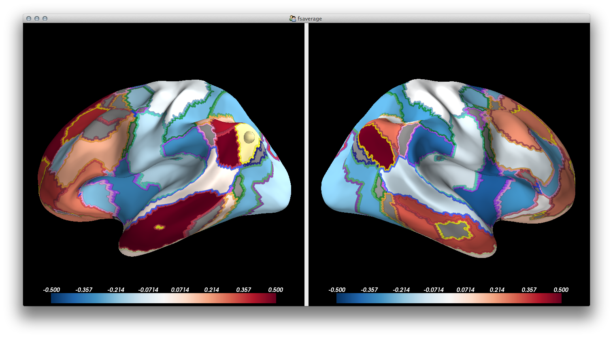

Connectivity Explorer
=====================

PySurfer extension for interactively exploring connectivity data on a Freesurfer cortex model.

The tool is intended to be used with a dataset that describes edge weights between regional nodes defined on a Freesurfer surface. It's most geared towards functional connectivity analyses, but it's implemented generally and any kind of data that can be described this way will work.

To use it, you input two data structures:

- `matrix`: A square, symettric matrix where each cell is the weight of the connection between the row and column nodes. This should be a Pandas DataFrame object with region names as the index and columns. The only constraint on the region names is that they have to start with either `"lh"` or `"rh"` to identify the hemisphere they lie in.

- `names:` A Pandas DataFrame with the region name corresponding to each vertex in the left and right hemisphere meshes. There must be a name for every vertex, but the names can be a superset of `matrix` index and column names (i.e., you can have a dataset that is missing data for some regions).

See the example data for an idea of how the input data should be structured.

Usage
-----

From the command line, using data stored in csv format:

```
./connexplore.py data/resting_matrix.csv data/yeo17_nodes.csv \
                 -annot Yeo2011_17Networks_N1000
```

From an interactive IPython session (make sure to run with `%gui qt` or similar), using data stored in Pandas objects:

```python
c = ConnectivityExplorer(evoked_matrix, vertex_names,
                         annot="Yeo2011_17Networks_N1000")
```

Either way will launch a PySurfer window. Right-click on the brain to seed the connectivity analysis.

There are a few other options for controlling what anatomy is used and how the colormap is scaled.



Dependencies
------------

- PySurfer
- Pandas

The tool does not depend on Freesurfer, but you do need to have used Freesurfer to process the anatomy you want to visualize. `$SUBJECTS_DIR` must be defined and have the required files.

If you don't have Freesufer but want to play around with the sample data, you can download the minimal (~20MB) [fsaverage dataset](http://faculty.washington.edu/larsoner/fsaverage_min.zip) that we use for testing PySurfer.

Development
-----------

This is intended mostly as a proof of concept and will probably remain fairly narrowly focused. It's BSD licensed, so feel free to build on it.

Known Issues
------------

There is a memory leak in PySurfer/Mayavi that will cause memory usage to grow over time as you explore different seeds.

License
-------

BSD (3-clause)
